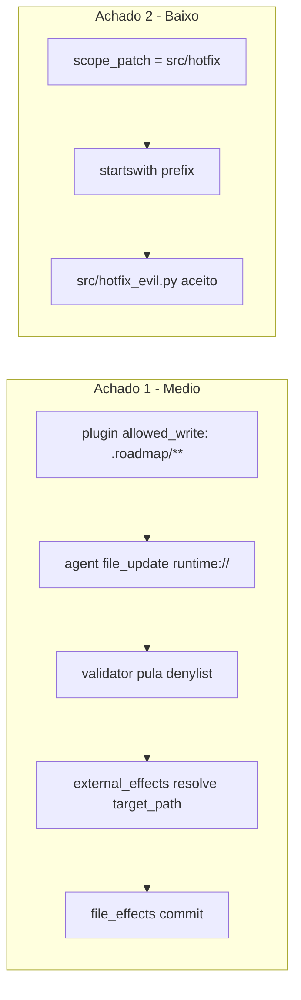
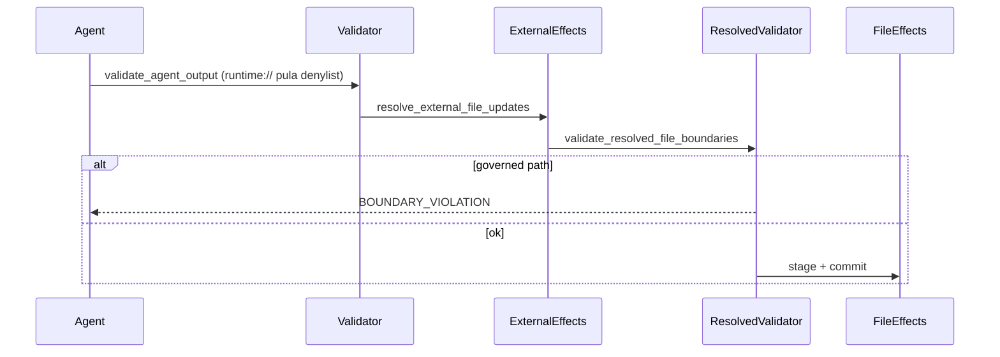

# Plano de Correção de Segurança — ESAA-Security

> Gerado a partir do relatório Codex em `/tmp/codex-security-scans/ESAA-Security/2dddf62_20260626T165625Z/report.md` (commit `2dddf62`).

## Contexto

O relatório identificou duas falhas nas fronteiras de escrita governada:



**Invariante violada (achado 1):** saídas de plugin/agente não podem escrever estado governado (`.roadmap/**`).

**Invariante violada (achado 2):** `scope_patch` deve representar limite de diretório/arquivo, não prefixo de string.

---

## Estratégia

Defesa em profundidade com **um módulo central** de regras de path, reutilizado em plugin validation, external effects, validator e hotfix creation — alinhado à recomendação do relatório ("centralize protected workspace path checks").

---

## 1. Novo módulo: `src/esaa/boundary_paths.py`

Criar helpers compartilhados (extraídos da lógica já parcial em `plugins.py:100-108` e `validator.py:120-121`):

| Função | Responsabilidade |
| --- | --- |
| `GOVERNED_STATE_EXACT` | Set com `.roadmap/activity.jsonl`, `roadmap.json`, `issues.json`, `lessons.json` |
| `is_governed_state_path(path)` | `True` se path == `.roadmap` ou começa com `.roadmap/` |
| `pattern_targets_governed_state(pattern)` | `True` se glob/pattern pode casar com estado governado (inclui `.roadmap`, `.roadmap/**`, e arquivos exatos) |
| `assert_writable_not_governed(path)` | Levanta `BOUNDARY_VIOLATION` |
| `validate_hotfix_scope_entries(scopes)` | Normaliza e rejeita escopos ambíguos sem `/` final quando parecem diretório |
| `path_within_scope(path, scope)` | Compara por ancestralidade (`PurePosixPath.parts`), não `startswith` |

**Regras de escopo hotfix:**

- Escopo terminando em `/` (ex.: `src/hotfix/`) → path deve estar **dentro** do diretório (prefixo de componentes).
- Escopo sem `/` final e **sem extensão de arquivo** (ex.: `src/hotfix`) → rejeitar na criação com `HOTFIX_SCOPE_INVALID` ("directory scope must end with '/'").
- Escopo sem `/` final com extensão (ex.: `src/hotfix/patch.py`) → match **exato** apenas.

---

## 2. Achado 1 — Plugin não pode sobrescrever `.roadmap/`

### 2a. Validação na instalação do plugin — `src/esaa/plugins.py`

Em `_validate_glob_pattern` (linha ~111), após checagem de wildcards perigosos:

```python
if pattern_targets_governed_state(normalized):
    raise ESAAError("PLUGIN_SCHEMA_INVALID", f"{label} cannot target governed ESAA state: {value}")
```

Refatorar `_validate_output_path` para usar `is_governed_state_path` / `assert_writable_not_governed` do módulo central (evitar duplicação das listas `forbidden`).

### 2b. Bloqueio na resolução runtime — `src/esaa/external_effects.py`

Em `resolve_external_file_updates`, **após** `target_path = _safe_relative_path(...)` (linha ~280):

```python
assert_writable_not_governed(target_path)
```

Isso fecha o bypass mesmo que o plugin declare `allowed_write: [".roadmap/**"]`.

### 2c. Validação pós-resolução no fluxo de submit — `src/esaa/validator.py` + `src/esaa/submission.py`

O early-return em `_validate_boundaries` (linhas 244-245) que pula `runtime://` permanece, mas adicionar nova função:

```python
def validate_resolved_file_boundaries(updates, contract, task) -> None:
```

Para cada `file_update` com `_esaa_target_path`:

1. Aplicar `assert_writable_not_governed(target_path)`
2. Aplicar `forbidden_write` do `task_kind` via `_matches_any` (mesma denylist de `AGENT_CONTRACT.yaml:205-206`)

Chamar em **ambos** os fluxos de submit em `submission.py` (linhas ~155 e ~393), imediatamente após `resolve_external_file_updates`:

```python
file_updates = resolve_external_file_updates(...)
validate_resolved_file_boundaries(file_updates, contract, task)
```



---

## 3. Achado 2 — Escopo de hotfix por ancestralidade

### 3a. Validação na criação — `src/esaa/events.py`

Em `validate_hotfix_request` (bloco `scope_patch`, linha ~86), chamar `validate_hotfix_scope_entries(scope)` antes de aceitar o hotfix.

Também normalizar o escopo padrão em `build_hotfix_event` (linha ~157) pela mesma função.

### 3b. Enforcement no boundary check — `src/esaa/validator.py`

Substituir (linha ~262):

```python
# antes
path.startswith(normalize_rel_path(prefix))
# depois
path_within_scope(path, prefix)
```

### 3c. External effects hotfix — `src/esaa/external_effects.py`

Substituir `_scope_allows` (linha ~68) para usar `path_within_scope` — mesma semântica, evita regressão em hotfixes com `runtime://`.

### 3d. CLI/admin — `src/esaa/task_admin.py`

Em `create_hotfix`, normalizar `scope_patch` via `validate_hotfix_scope_entries` antes de passar ao `build_hotfix_event`.

---

## 4. Testes de regressão

Novo arquivo `tests/test_security_boundary_fixes.py`:

### Achado 1

| Teste | Expectativa |
| --- | --- |
| `validate_plugin_dir` com `allowed_write: [".roadmap/**"]` | `PLUGIN_SCHEMA_INVALID` |
| `resolve_external_file_updates` mapeando `runtime://` → `.roadmap/issues.json` | `BOUNDARY_VIOLATION` |
| `ESAAService.submit()` com plugin malicioso simplificado | `.roadmap/issues.json` **não** alterado |

Reutilizar fixtures de `tests/conftest.py` (`contract_bundle`) e padrões de plugin de `tests/test_post_survey_fixes.py`.

### Achado 2

| Teste | Expectativa |
| --- | --- |
| `validate_hotfix_request` com `scope_patch=["src/hotfix"]` | `HOTFIX_SCOPE_INVALID` |
| `_validate_boundaries` / `path_within_scope`: `src/hotfix/` + `src/hotfix/file.py` | aceito |
| Mesmo escopo + `src/hotfix_evil.py` | `BOUNDARY_VIOLATION` |
| `src/hotfix/../other.py` | rejeitado (traversal existente) |
| Escopo padrão `src/hotfix/` em hotfix gerado | continua funcionando (`test_hotfix_lifecycle.py`) |

Atualizar `tests/test_hotfix_create_validation.py` se algum caso usar escopo ambíguo sem `/`.

---

## 5. Verificação

```bash
pip install -e ".[dev]"
python3 -m pytest tests/test_security_boundary_fixes.py tests/test_hotfix_create_validation.py tests/test_hotfix_lifecycle.py tests/test_boundary_grant.py -q
python3 -m pytest tests/ -q
```

Garantir que testes existentes de `boundary_grant` (`tests/test_boundary_grant.py`) continuam passando — a regra `.roadmap/**` proibido já existe para grants e deve permanecer consistente com o novo módulo.

---

## Arquivos tocados (resumo)

| Arquivo | Mudança |
| --- | --- |
| `src/esaa/boundary_paths.py` | **novo** — regras centralizadas |
| `src/esaa/plugins.py` | rejeitar `.roadmap/**` em `allowed_write` |
| `src/esaa/external_effects.py` | bloqueio pós-resolução + `_scope_allows` |
| `src/esaa/validator.py` | `validate_resolved_file_boundaries` + `path_within_scope` |
| `src/esaa/submission.py` | chamar validação pós-resolução |
| `src/esaa/events.py` | validar escopo na criação de hotfix |
| `src/esaa/task_admin.py` | normalizar escopo no CLI |
| `tests/test_security_boundary_fixes.py` | **novo** — regressões dos 2 achados |

**Fora de escopo:** alteração de documentação/README além deste plano, mudança de `AGENT_CONTRACT.yaml` (a denylist já proíbe `.roadmap/**` — o bug era o bypass de `runtime://`, não o contrato em si).

---

## Tarefas de implementação

- [x] Criar `src/esaa/boundary_paths.py` com helpers de estado governado e escopo hotfix
- [x] Aplicar bloqueio em `plugins.py`, `external_effects.py`, `validator.py` e `submission.py` (achado 1)
- [x] Aplicar `path_within_scope` e validação de escopo em `events.py`, `validator.py`, `external_effects.py`, `task_admin.py` (achado 2)
- [x] Adicionar `tests/test_security_boundary_fixes.py` e ajustar testes hotfix existentes
- [x] Rodar pytest focado e suite completa para confirmar zero regressões

## Status de conclusão

Implementado conforme o plano. Verificação reportada:

```bash
PYTHONPATH=src python3 -m pytest tests/ -q
# 175 passed
```
